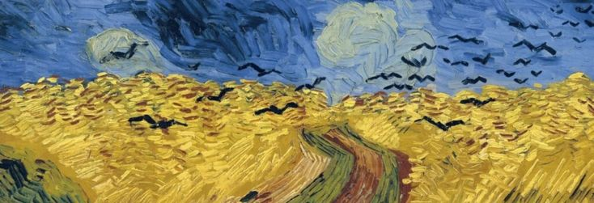

<p align="center"> </p>
# Hey, I'm Daniel 👋

Founder & builder based in Tanzania. I make software that helps people think clearer, work better, and stay accountable to what actually matters.

---

## What I'm Building

**[Willem](https://github.com/Mchawikaraba)** — A desktop accountability coach for macOS and Windows.  
Declare your goal → Willem watches your screen → nudges you back when you drift. Powered by Claude AI and delivered via voice through ElevenLabs. Built with Electron, React, and SQLite.

**Accountable** — A React Native/Expo app that uses social visibility to curb social media overuse.  
Your partner sees exactly how much time you spend scrolling. FOMO as a feature. Stack: Supabase, Firebase, RevenueCat, Claude API.

---

## Stack

```
Languages     TypeScript · JavaScript · Python · C
Frontend      React · React Native · Electron · Expo · Tailwind
Backend       Supabase · SQLite · Deno · Node.js
AI            Claude API (Anthropic) · ElevenLabs TTS
Tools         Blender · Figma · Photoshop
```

---

## Background

- 🏆 Rise Finalist 2023
- 🌍 Building for global markets from Dar es Salaam
- 🎨 Designer at heart — 3D in Blender, poster work, obsessive about typography
- 📐 Interested in the intersection of AI, cognition, and self-development

---

## A Few Things I Care About

- Interfaces that respect the user's attention
- AI that coaches rather than replaces
- Design systems with real constraints and real opinions
- Shipping things that are actually useful

---

## Connect

[](https://github.com/Mchawikaraba)

---

*Currently deep in Willem's UI architecture. Always open to conversations about AI products, accountability tools, or design systems.*
